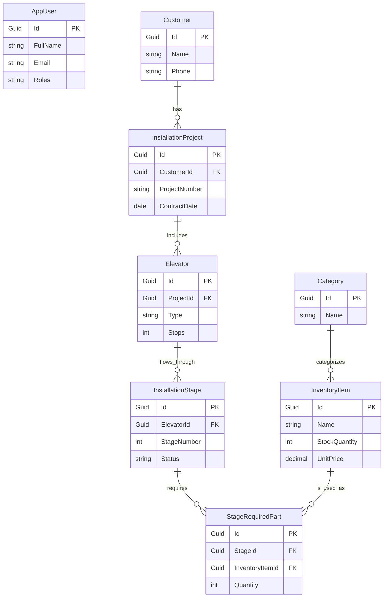

# project_reference

## 1. System Overview

**Purpose**:  
The LiftOps-BackEnd system is a comprehensive management solution for an elevator and escalator company. It handles inventory management, installation project workflows, and administrative user management.

**Main Modules**:
1.  **Authentication & Admin**: User management, role assignment (MediatR based commands).
2.  **Inventory**: Management of parts (`InventoryItem`) and categories.
3.  **Installation**: Detailed project management including customers, contracts, elevators, installation stages (1-4), and reporting.

**Core Features**:
*   **Role-Based Access Control (RBAC)**: Fine-grained permissions (Manager, InstallationAdmin, InventoryAdmin, etc.).
*   **CQRS Architecture**: Command Query Responsibility Segregation using MediatR.
*   **Audit Logging**: Automatic tracking of `CreatedBy`, `LastModifiedBy`, etc., on all entities.
*   **Workflow Automation**: Automatic stage progression and PDF report generation for installations.

**Architecture**:
*   **Backend**: .NET 10 Web API.
*   **Database**: SQL Server (Entity Framework Core 10).
*   **Pattern**: Clean Architecture (Domain, Application, Infrastructure, API).

---

## 2. ERD Diagram

**Entities & Relations**:
*   `Customer` (1) —has— (*) `InstallationProject`
*   `InstallationProject` (1) —has— (*) `Elevator`
*   `Elevator` (1) —has— (*) `InstallationStage`
*   `InstallationStage` (1) —has— (*) `StageRequiredPart`
*   `Category` (1) —has— (*) `InventoryItem`
*   `InventoryItem` (1) —used_in— (*) `StageRequiredPart`
*   `AppUser` (Identity) links to `Notification` and auditing fields.

---

## 3. Entities

### Identity & Common
#### **[AppUser](file:///c:/Users/mhmd/Desktop/LiftOps/LiftOps-BackEnd.Domain/Entities/AppUser.cs)**
*   **Table**: `AspNetUsers` (Extended)
*   **Purpose**: Represents authenticated users.
*   **Properties**:
    *   `FullName` (string): User's real name.
    *   `IsDisabled` (bool): Soft delete/block flag.
    *   `RefreshToken` (string?): For JWT rotation.
    *   `Audit Fields`: `CreatedAt`, `CreatedBy`, etc.

### Inventory Module
#### **[InventoryItem](file:///c:/Users/mhmd/Desktop/LiftOps/LiftOps-BackEnd.Domain/Entities/InventoryItem.cs)**
*   **Table**: `InventoryItems`
*   **Purpose**: Spare parts management.
*   **Properties**:
    *   `Name` (string): Item name.
    *   `CategoryId` (Guid): FK to Category.
    *   `StockQuantity` (int): Available stock.
    *   `UnitPrice` (decimal): Cost per unit.
    *   `IsDisabled` (bool): Soft delete.

### Installation Module
#### **[Customer](file:///c:/Users/mhmd/Desktop/LiftOps/LiftOps-BackEnd.Domain/Entities/Installation/Customer.cs)**
*   **Table**: `Customers`
*   **Properties**: `Name`, `Phone`, `Email`, `Address`, `ProjectNumber`.
*   **Note**: `ProjectNumber` is stored on Customer as per current design.

#### **[InstallationProject](file:///c:/Users/mhmd/Desktop/LiftOps/LiftOps-BackEnd.Domain/Entities/Installation/InstallationProject.cs)**
*   **Table**: `InstallationProjects`
*   **Properties**: `CustomerId` (FK), `InstallationAdminId` (FK), `InstallationPricePerUnit`, `TotalPrice`, `ContractDate`.

#### **[Elevator](file:///c:/Users/mhmd/Desktop/LiftOps/LiftOps-BackEnd.Domain/Entities/Installation/Elevator.cs)**
*   **Table**: `Elevators`
*   **Properties**: `ProjectId` (FK), `ElevatorType`, `NumberOfStops`, `NumberOfFloors`.

#### **[InstallationStage](file:///c:/Users/mhmd/Desktop/LiftOps/LiftOps-BackEnd.Domain/Entities/Installation/InstallationStage.cs)**
*   **Table**: `InstallationStages`
*   **Purpose**: Tracks progress of single stage (1-4).
*   **Properties**: `ElevatorId` (FK), `StageNumber`, `Status` (Enum), `StartDate`, `EndDate`, `SupplyCost`, `PdfPath`.

#### **[StageRequiredPart](file:///c:/Users/mhmd/Desktop/LiftOps/LiftOps-BackEnd.Domain/Entities/Installation/StageRequiredPart.cs)**
*   **Table**: `StageRequiredParts`
*   **Properties**: `StageId` (FK), `InventoryItemId` (FK), `Quantity`, `IsOutOfStock` (bool).

#### [Technician](file:///c:/Users/mhmd/Desktop/LiftOps/LiftOps-BackEnd.Domain/Entities/Installation/Technician.cs)
*   **Table**: `Technicians`
*   **Properties**: `Name`, `Phone`, `Specialization`, `TotalElevatorsInstalled` (int), `CurrentActiveElevatorsCount` (int), `OverallRating` (double?), `IsDisabled`.
*   **Relations**: `Assignments` (M:N with Elevator).

#### 6. Maintenance Subsystem
- **Entities**:
  - `MaintenanceContract`: Customer contracts with monthly price, free months, etc.
  - `MaintenanceElevator`: Elevators covered by contracts.
  - `MaintenanceVisit`: Scheduled visits for elevators.
  - `MaintenanceSparePartUsage`: Parts used during visits.
- **DTOs**: `CreateMaintenanceContractDto`, `ScheduleVisitDto`, `CompleteVisitDto`.
- **Services**: `IMaintenanceService` (Contracts, Scheduling, Inventory integration).
- **Controllers**: `MaintenanceController` (Manager, MaintenanceAdmin).

### 7. Faults (Breakdowns) Subsystem
- **Entities**:
  - `FaultTicket`: Trouble tickets with severity, status, technician.
  - `FaultSparePartUsage`: Parts used for repairs.
- **DTOs**: `CreateFaultTicketDto`, `AssignFaultTechnicianDto`, `ResolveFaultDto`.
- **Services**: `IFaultService` (Ticket lifecycle, Inventory integration).
- **Controllers**: `FaultsController` (Manager, FaultsAdmin, MaintenanceAdmin).

### 8. Notification System
- **Entity**: `Notification` (Title, Message, Type, TargetUserId).
- **Types**: Info, Warning, Error, OutOfStock, StageCompleted, NewFault.
- **Service**: `INotificationService` (Supports creating notifications with full metadata).

### 9. Technician Management
- **Description**: Manages technician profiles, assignments, and performance.
- **Key Entities**: `Technician`, `TechnicianAssignment`.
- **Key Services**: `ITechnicianService`.
- **Controllers**: `TechnicianController` (Manager), `InstallationController` (Assign/Unassign).
#### [TechnicianAssignment](file:///c:/Users/mhmd/Desktop/LiftOps/LiftOps-BackEnd.Domain/Entities/Installation/TechnicianAssignment.cs)
*   **Table**: `TechnicianAssignments`
*   **Properties**: `TechnicianId` (FK), `ElevatorId` (FK), `AssignedBy` (UserId), `AssignedAt`.

---

## 4. DTOs

### Admin DTOs
*   `LoginDto`: `Email`, `Password`.
*   `RegisterAdminDto`: `Email`, `Password`, `FullName`, `Roles`.
*   `UpdateAdminDto`: `FullName`, `Email`.

### Inventory DTOs
*   `CreateInventoryItemDto`: `Name`, `CategoryId`, `StockQuantity`, `UnitPrice`.
*   `UpdateInventoryItemDto`: `Name`, `StockQuantity`, `UnitPrice`.

### Installation DTOs
*   `CreateProjectDto`: Wrapper for `CustomerDto`, `ContractDto`, `List<CreateElevatorDto>`.
*   `AddElevatorDto`: `ElevatorType`, `Stops`, `Floors`.
*   `PartSelectionDto`: `InventoryItemId`, `Quantity`.
*   `InstallationProjectDto`: Response DTO with full hierarchy (Customer -> Project -> Elevators).

### Technician DTOs
*   `CreateTechnicianDto`: `Name`, `Phone`, `Specialization`.
*   `TechnicianDto`: `Id`, `Name`, `Stats` (Total/Active), `Rating`.
*   `AssignTechnicianDto`: `ElevatorId`, `TechnicianIds` (List).

---

## 5. Controllers

### [AdminController](file:///c:/Users/mhmd/Desktop/LiftOps/LiftOps-BackEnd.API/Controllers/AdminController.cs)
**Route**: `api/Admin`
*   `POST /login`: Authenticates user. Returns JWT + Refresh Token.
*   `POST /register`: [Manager Only] Creates new admin account.
*   `PUT /roles/{id}`: [Manager Only] Assigns roles to user.
*   `PUT /disable/{id}`: [Manager Only] Blocks/Unblocks user.

### [InventoryController](file:///c:/Users/mhmd/Desktop/LiftOps/LiftOps-BackEnd.API/Controllers/InventoryController.cs)
**Route**: `api/Inventory`
**Access**: Manager, InventoryAdmin
*   `POST /add`: Creates new item.
*   `GET /all` & `GET /active`: Lists items.
*   `PUT /update/{id}`: Updates item details/stock.

### [InstallationController](file:///c:/Users/mhmd/Desktop/LiftOps/LiftOps-BackEnd.API/Controllers/InstallationController.cs)
**Route**: `api/Installation`
**Access**: Manager, InstallationAdmin
*   `POST /project/add`: Orchestrates full project creation.
*   `POST /stage/start`: Marks stage as InProgress.
*   `POST /stage/parts`: Adds parts to stage (checks stock).
*   `POST /stage/complete`: Completes stage, triggers PDF generation & Tech Stats Update.
*   `POST /elevator/{id}/assign-technicians`: Assigns technicians to elevator.
*   `DELETE /elevator/{id}/unassign-technician/{techId}`: Unassigns technician.

### [TechnicianController](file:///c:/Users/mhmd/Desktop/LiftOps/LiftOps-BackEnd.API/Controllers/TechnicianController.cs)
**Route**: `api/Technician`
**Access**: Manager
*   `POST /add`: Creates new technician.
*   `PUT /update/{id}`: Updates info.
*   `PUT /disable/{id}`: Disables/Enables.
*   `GET /all`: Lists all.
*   `GET /available`: Lists those with low workload (< 5 active).

---

## 6. Services & Handlers

In this Clean Architecture solution, "Services" are split between **Domain Services** (Infrastructure implementations) and **Application Handlers** (Mediator).

### Infrastructure Services
*   `PdfGeneratorService`:
    *   **Purpose**: Generates PDF reports using QuestPDF.
    *   **Used By**: `StageService`.
*   `NotificationService`:
    *   **Purpose**: Creates in-app notifications in DB.
    *   **Used By**: `PartSelectionService`.
*   `TokenService` (implied):
    *   **Purpose**: Generates JWT and Refresh Tokens.
*   `TechnicianService`:
    *   **Purpose**: CRUD, Assignment logic, Stats updates.
    *   **Used By**: `TechnicianController`, `StageService`.

### Installation Services (Domain Logic Wrapper)
*   `InstallationProjectService`: Validates project logic.
*   `StageService`: Manages stage lifecycle (Start -> Complete -> Next). Delegates to `TechnicianService` for stats.
*   `PartSelectionService`: Checks stock vs request, logs out-of-stock.

### Mediator Handlers (Application Layer)
*   `CreateInstallationProjectCommandHandler`: Orchestrates Project + Elevator creation.
*   `CompleteStageCommandHandler`: Delegates to `StageService`.
*   `AddTechnicianCommandHandler`: Delegates to `TechnicianService`.

---

## 7. Methods Summary

| Context | Method | Summary | Parameters | Returns |
| :--- | :--- | :--- | :--- | :--- |
| **Auth** | `Login` | Validates credentials, returns JWT. | `LoginDto` | `TokenResponse` |
| **Auth** | `AssignRoles` | Adds roles to user (Manager only). | `UserId`, `Roles[]` | `bool` |
| **Inventory** | `AddInventoryItem` | Creates new part in DB. | `CreateInventoryItemDto` | `ItemId` |
| **Project** | `CreateProject` | Creates Customer, Project, Elevators, Stages. | `CreateProjectDto` | `ProjectId` |
| **Stage** | `StartStage` | Sets status to InProgress, records StartDate. | `StageId`, `Date` | `void` |
| **Stage** | `AddParts` | Links inventory to stage, tracks out-of-stock. | `StageId`, `Parts[]` | `void` |
| **Stage** | `CompleteStage` | Sets Success, Gen PDF, Triggers Next Stage. | `StageId`, `Cost`, `Notes` | `void` |
| **PDF** | `GenerateStageReport` | Creates PDF using QuestPDF. | `InstallationStage` | `FilePath` (string) |

---

## 8. Business Rules & Logic

1.  **Role Hierarchy**:
    *   **Manager**: Super admin, can manage other admins.
    *   **InstallationAdmin**: Can manage Projects, Elevators, Stages.
    *   **InventoryAdmin**: Can manage Spare Parts (CRUD).
    *   **FinanceAdmin**: (Placeholder) View costs.
2.  **Installation Workflow**:
    *   Project must have a Customer.
    *   Elevators automatically get 4 defined Stages upon creation.
    *   Stages must progress sequentially (logic exists but simplified).
    *   **Stock Rule**: Parts *can* be selected even if `Stock < Quantity` (triggers notification).
3.  **Project Number Uniqueness**:
    *   Project numbers must be unique per Customer (checked at creation).

---

## 9. Configurations

### `appsettings.json`
*   `ConnectionStrings:DefaultConnection`: SQL Server connection string.
*   `Jwt:Key`: Secret key for signing tokens (min 64 chars).
*   `Jwt:Issuer` / `Jwt:Audience`: Token validation parameters.
*   `Jwt:DurationInMinutes`: Access token lifetime.

### Environment Variables
*   `ASPNETCORE_ENVIRONMENT`: `Development` / `Production` (Toggles Swagger).

### Constants
*   `Roles`: Defined in `LiftOps_BackEnd.Domain.Common.Roles` (`Manager`, `InstallationAdmin`, etc.).

---

## 10. Deployment & Infrastructure

### Local Development
1.  **Prerequisites**: .NET 10 SDK, SQL Server.
2.  **Setup**:
    *   Update `ConnectionStrings:DefaultConnection` in `API/appsettings.json`.
    *   Run `dotnet ef database update --project LiftOps-BackEnd.Infrastructure --startup-project LiftOps-BackEnd.API`.
    *   (Optional) Seeding happens automatically on startup.
3.  **Run**:
    *   `dotnet run --project LiftOps-BackEnd.API`
    *   Access Swagger at `https://localhost:7084/swagger`.

### Deployment
1.  **Build**: `dotnet publish -c Release -o ./publish`
2.  **Hosting**: IIS, Kestrel, or Docker.
3.  **CI/CD**: GitHub Actions workflow (recommended) to build and run tests.

---

## 11. Data Flow

### Request Lifecycle (CQRS)
1.  **Client** sends HTTP Request (e.g., `POST /project/add`).
2.  **Controller** receives request, extracts User Claims.
3.  **Controller** sends **Command** via `_mediator.Send(command)`.
4.  **Handler** (`CreateInstallationProjectCommandHandler`) intercepts Command.
5.  **Handler** calls **Domain Service** (`InstallationProjectService`).
6.  **Service** executes logic, uses **Repository** (`IInstallationProjectRepository`).
7.  **Repository** writes to **DB** via EF Core.
8.  **Result** flows back: DB -> Repo -> Service -> Handler -> Controller -> Client.

### PDF & Storage
*   Generated PDFs are stored in `wwwroot/reports/{ProjectId}/{ElevatorId}/`.
*   Served as static files or accessible via API return (path).

---

## 12. Naming Conventions

*   **Files/Classes**: PascalCase (`InstallationProject.cs`).
*   **Interfaces**: `I` prefix (`IInstallationProjectRepository`).
*   **Methods**: PascalCase (`CreateProjectAsync`).
*   **Private Fields**: Underscore + camelCase (`_projectRepository`).
*   **DTOs**: Suffix with `Dto` (`CreateProjectDto`).
*   **Commands/Queries**: Verb + Noun + Type (`CreateInstallationProjectCommand`).
*   **Controllers**: Entity + `Controller` (`InstallationController`).
*   **Routes**: Lowercase, noun-based (`api/installation`).

---

## 13. Frontend Integration Guide

This section helps frontend developers quickly integrate with the LiftOps-BackEnd.

### **Authentication Flow**
1.  **Login**: Send credentials to `POST /api/Admin/login`.
2.  **Storage**: Save `token`, `refreshToken`, and `user` info (Name, Email, Roles) in `localStorage` or `cookies`.
3.  **Headers**: Include the token in all subsequent requests:
    `Authorization: Bearer <token>`
4.  **Refresh**: If a request returns `401 Unauthorized`, attempt to call `POST /api/Admin/refresh-token` using the stored tokens.

### **API Client Recommendations**
-   **Base URL**: Use `process.env.NEXT_PUBLIC_API_URL` (default: `http://localhost:5295`).
-   **Interceptors**: Implement an Axios or Fetch interceptor to automatically add the `Authorization` header and handle token refresh logic.
-   **Error Handling**: The backend consistently returns a `Result<T>` object or standard HTTP error codes (400, 401, 403, 404, 500).

### **Key Frontend Routes & Logic**
-   **Dashboard**: Fetches from `api/Dashboard/summary`. Use the `recentActivities` list to populate feed components.
-   **Installation Workflow**: 
    -   Projects are viewed at `api/Installation/projects`.
    -   Elevator stages must be updated via the `/stage/start`, `/stage/parts`, and `/stage/complete` endpoints.
-   **Inventory**: Managed via `api/Inventory`. Note that parts can be added to installation stages even if out-of-stock (system logs a warning notification).

### **Documentation Reference**
For a full list of endpoints and DTO structures, see [API_ENDPOINTS.md](file:///c:/Users/mhmd/Desktop/Collins-Project/LiftOps/API_ENDPOINTS.md).

