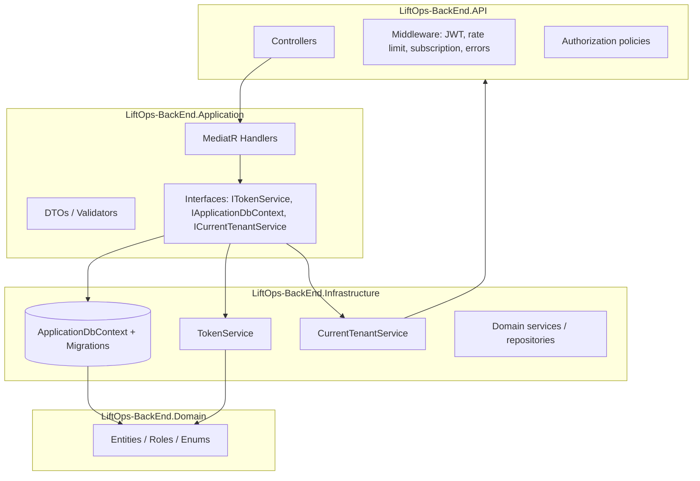

# LiftOps Architecture

Documentation reflects the repository as of the last audit: backend under `LiftOps/`, frontend under `liftops-frontend/`. There is no `Src/` folder; project names are `LiftOps-BackEnd.*`.

## Project identity

LiftOps is a multi-tenant SaaS for elevator operations: installation pipeline, maintenance contracts, inventory, emergency tickets, and a **platform console** for operators to manage companies, plans, and subscriptions.

## System overview

| Layer | Technology |
|--------|----------------|
| API | ASP.NET Core (net10.0), JWT Bearer auth |
| Application | MediatR, FluentValidation, DTOs/commands/queries |
| Domain | Entities, enums, `Roles` constants; `AppUser` extends Identity |
| Persistence | EF Core 10, SQL Server, global tenant query filters |
| Frontend | Next.js 16 (App Router), React 19, TypeScript, Tailwind 4, ShadCN/Radix |

## Clean architecture flow

Requests enter the API layer only through controllers. Controllers resolve the current user from `HttpContext`, authorize via policies, then dispatch **one** MediatR request per action. Handlers live in **Application** and depend on **interfaces** implemented in **Infrastructure** (repositories, `ApplicationDbContext`, `TokenService`, `CurrentTenantService`). **Domain** has no framework references beyond Identity stores on `AppUser`.

## Multi-tenant strategy

### Tenant unit

- **Tenant** = `Company` (`Companies` table).
- Almost all business rows inherit `CompanyId` via `BaseAuditableEntity` (not `Company` itself; `Company.CompanyId` is ignored in EF).

### How `company_id` works (tenant users)

1. On login/refresh, **Infrastructure** `TokenService.CreateToken` adds claim **`company_id`** only for users who are **not** in role **`PlatformAdmin`** and who have a non-null, non-empty `AppUser.CompanyId`.
2. **Infrastructure** `CurrentTenantService` reads `company_id` (or legacy `tenant_id`) from `HttpContext.User`.
3. **ApplicationDbContext** applies a global `HasQueryFilter` on all `BaseAuditableEntity` types: rows match when bypass flag is set **or** `EffectiveTenantId == e.CompanyId`. `EffectiveTenantId` is the current tenant from claims or an explicit override used by background jobs (`UseSystemTenantBypass`).
4. **Program.cs** `JwtBearerEvents.OnTokenValidated`: for any **authorized, non-anonymous** endpoint that is **not** under `/api/platform`, the principal **must** include a non-empty **`company_id`** claim. That enforces tenant context on normal API traffic.
5. Role policies such as `RequireManager` combine **role** with **`RequireAssertion(HasTenantClaim)`** so tenant admins always carry `company_id`.

### Super admin (platform) vs tenant

| Aspect | Tenant user | Platform admin (`PlatformAdmin`) |
|--------|-------------|----------------------------------|
| `AppUser.CompanyId` | Set to a real company GUID | **`null`** (nullable after migration `PLAT002`) |
| JWT `company_id` | Present | **Omitted** (even if data were wrong, token builder skips it for `PlatformAdmin`) |
| `OnTokenValidated` company check | Required on non-platform routes | **Skipped** for `/api/platform/*` paths only |
| Authorization | Policies with tenant assertion | **`RequirePlatformAdmin`** (role only, no tenant claim) |
| Data access | Filtered by tenant | Handlers use `IgnoreQueryFilters()` + `UseSystemTenantBypass` where needed |

Platform APIs live under **`/api/platform/...`** and use **`[Authorize(Policy = "RequirePlatformAdmin")]`**.

### Mental model

- **Missing `company_id` in JWT** ⇒ not scoped to a tenant for data APIs ⇒ rejected by JWT validation (except platform routes).
- **`PlatformAdmin` + `CompanyId = null`** ⇒ no tenant slice; platform work is explicit and isolated from tenant filters unless code uses bypass.

## Frontend architecture (summary)

- **Next.js App Router** under `liftops-frontend/app/`.
- **BFF-style auth**: `POST /api/auth/login` (Next Route Handler) calls the .NET API and sets **httpOnly** cookies (`liftops_access`, `liftops_refresh`) while the client still stores tokens/user in `localStorage` for the existing API client.
- **`middleware.ts`** protects **`/admin/*`** (except `/admin/login`) by decoding the access cookie and requiring role **`PlatformAdmin`**.
- **`AuthGuard`** continues to enforce role-based access for the rest of the app client-side.

## Core business domains (backend)

Installation, maintenance, emergency, faults, inventory, customers/projects, technicians, dashboard, admin user management, **platform** (companies, plans, subscriptions, users, impersonation).

## Related docs

- `docs/BACKEND_GUIDE.md` — auth endpoints, DTOs, seeding.
- `docs/FRONTEND_GUIDE.md` — routes, auth files, middleware.
- `docs/AI_CONTEXT.md` — condensed context for AI assistants.
